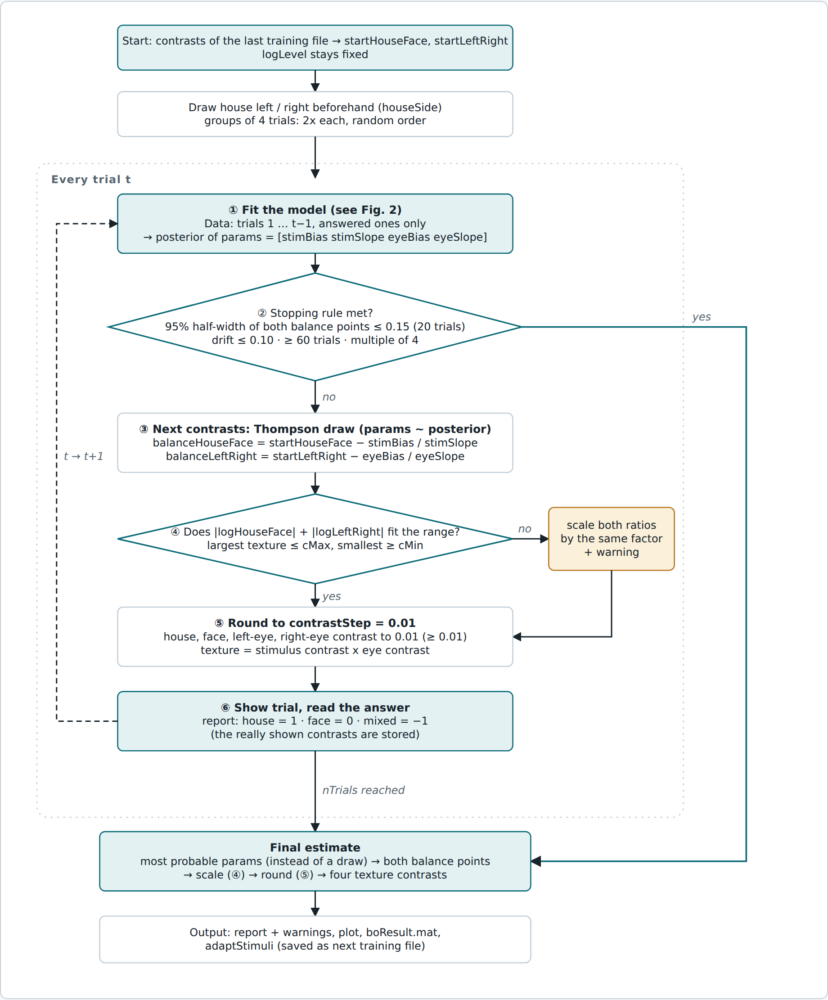
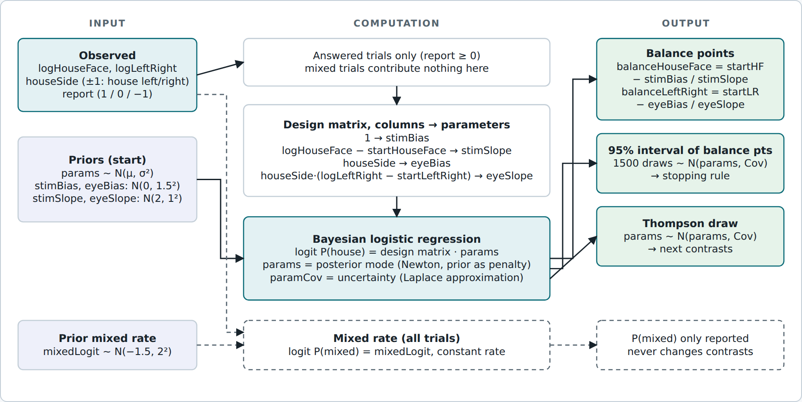

# contrastBO – adaptive contrast balancing for onset rivalry

`speedRunOnset.m` shows one house and one face per trial, one to each eye, and
the participant reports what they saw first (house, face, or "none" = mixed).
This package chooses the contrasts of the four textures (FaceLeft, FaceRight,
HouseLeft, HouseRight) from the answers so far, so that

* house and face are reported equally often (**stimulus balance**), and
* the stimulus in the left eye and the one in the right eye are reported
  equally often (**eye balance**).

It does so with a small Bayesian model that is refitted after every trial.
Only the case *level fixed, one shared model* is implemented.



*Figure 1. One run. The model is fitted before every trial, then either the
stopping rule ends the run or the next contrasts are drawn.*

---

## 1. Quantities and names

Everything the optimiser touches is on a log scale.

| name | meaning |
|---|---|
| `logLevel` | overall contrast level: log of the geometric mean of the four texture contrasts. **Fixed** at its start value. |
| `logHouseFace` | ln(house contrast / face contrast). `> 0`: house has the higher contrast. **Adapted.** |
| `logLeftRight` | ln(left-eye contrast / right-eye contrast). `> 0`: left eye has the higher contrast. **Adapted.** |
| `startHouseFace`, `startLeftRight` | `logHouseFace`, `logLeftRight` of the start contrasts (the latest training file). Stored in `cfg.startLog(2:3)`. |
| `balanceHouseFace`, `balanceLeftRight` | the values of `logHouseFace` / `logLeftRight` at which the model predicts 50 : 50. **These are what the model estimates.** |
| `houseSide` | `+1` if the house is shown to the left eye, `-1` if to the right eye. Drawn before the run, balanced within every group of 4 trials, never chosen by the model. |
| `report` | answer of a trial: `1` house, `0` face, `-1` mixed / none. |
| `params` | the four model parameters `[stimBias stimSlope eyeBias eyeSlope]`. |
| `paramCov` | 4 x 4 covariance (uncertainty) of `params`. |
| `mixedLogit` | logit of the constant mixed-percept rate. |
| `contrastStep` | resolution of the contrasts, `0.01`. |

Vectors: `logContrast = [logLevel logHouseFace logLeftRight]` (1 x 3), a matrix
of them with one row per trial is `logContrastShown`.

### From log values to texture contrasts (`paramsToContrasts`)

The numbers stored in the training file are a house and a face contrast and a
left- and a right-eye contrast; the contrast of a texture is their product. The
**whole level sits on the stimulus contrasts**; the eye contrasts only carry the
left/right ratio:

```
houseContrast    = exp(logLevel + logHouseFace/2)    faceContrast     = exp(logLevel - logHouseFace/2)
leftEyeContrast  = exp( logLeftRight/2)              rightEyeContrast = exp(-logLeftRight/2)

houseLeft  = houseContrast * leftEyeContrast       faceLeft  = faceContrast * leftEyeContrast
houseRight = houseContrast * rightEyeContrast      faceRight = faceContrast * rightEyeContrast
```

Seen from the textures, every texture has `ln(contrast) = logLevel ± logHouseFace/2 ± logLeftRight/2`,
so `exp(logLevel)` is the geometric mean of the four textures.
`contrastsToParams` is the inverse.

Worked example (sub-33): `logLevel = 0`, `logHouseFace = 0.475`, `logLeftRight = -0.327`:

| texture | log | contrast |
|---|---|---|
| HouseLeft  | 0 + 0.2375 - 0.1635 | 1.077 |
| FaceRight  | 0 - 0.2375 + 0.1635 | 0.929 |
| HouseRight | 0 + 0.2375 + 0.1635 | 1.493 |
| FaceLeft   | 0 - 0.2375 - 0.1635 | 0.670 |


---

## 2. The model



*Figure 2. Inside the "fit the model" step. The dashed mixed-rate model reads
all trials but only produces a number for the report.*

### 2.1 What is modelled

The probability that a trial is reported as "house" (given that it was
answered) depends on how far the shown contrasts are from the start contrasts:

```
logit P(house) = stimBias + stimSlope * (logHouseFace - startHouseFace)
               + houseSide * ( eyeBias + eyeSlope * (logLeftRight - startLeftRight) )
```

i.e. `P(house) = sigmoid( ... )`, `sigmoid(z) = 1 / (1 + exp(-z))`. Equivalently
a softmax over two logits `[zHouse, zFace]` with `zFace = 0`; only the
difference `zHouse - zFace` can be estimated, so one of the two is fixed.

| parameter | meaning | prior (`cfg.paramPriorMean / SD`) |
|---|---|---|
| `stimBias`  | stimulus bias at the start contrasts. `> 0` house favoured, `< 0` face favoured | N(0, 1.5²) |
| `stimSlope` | how much one ln-unit of `logHouseFace` moves the logit | N(2, 1²) |
| `eyeBias`   | eye bias at the start contrasts. `> 0` left eye favoured | N(0, 1.5²) |
| `eyeSlope`  | how much one ln-unit of `logLeftRight` moves the logit | N(2, 1²) |

The `houseSide` factor flips the sign of the eye term: a stronger left eye
helps whatever is shown to the left, which is the house when `houseSide = +1`
and the face when `houseSide = -1`.

Why these priors: the biases are centred on 0 (no bias) with a wide spread, so
a strong bias is possible but costs evidence. The slopes are centred on 2 and
must be positive (more contrast helps); the prior keeps them from becoming
huge when the first few answers happen to be perfectly consistent. The prior
also guarantees a finite solution early in the run. `cfg.minSlope = 0.3` is a
lower bound on both slopes in draws and in the final estimate.

### 2.2 What is the goal

The **balance points** are where both terms are zero, so that `logit P(house) = 0`
for either value of `houseSide`:

```
balanceHouseFace = startHouseFace - stimBias / stimSlope      (stimulus term = 0)
balanceLeftRight = startLeftRight - eyeBias  / eyeSlope       (eye term = 0)
```

Both terms must be zero: if only the stimulus term were zero, `logit P(house)`
would be `+B` for house-left trials and `-B` for house-right trials, with
`B` the eye term. The two balance points are independent: one only depends on
the stimulus parameters, the other only on the eye parameters. Only the biases
and their ratio to the slopes matter for the result; the slopes are needed to
convert a bias (a logit) into a contrast.

### 2.3 Fitting (`fitLogistic`, `fitModels`)

After every trial the model is fitted to all answered trials so far:

1. `log posterior(params) = sum over trials log P(report | params, contrasts) + log prior(params)`.
2. A damped Newton method finds the maximum, `params` (MAP estimate).
3. The posterior is approximated by a Gaussian around it (Laplace
   approximation): `params ~ N(params, paramCov)`, `paramCov` is the inverse of
   the negative Hessian at the maximum.

The model is fitted on the contrasts that were **really shown** (after
rounding), not on the ones that were asked for. Fit time is a few ms.

### 2.4 Mixed trials

* **Not used for the balance model.** A "none" answer says nothing about which
  stimulus is stronger, so these trials are removed before fitting `params`.
* **A second, tiny model** (`model.mix`) reads *all* trials: a constant mixed
  rate `logit P(mixed) = mixedLogit`, prior N(-1.5, 2²) (about 18 % before any
  data). It is only reported ("model expects ... mixed %") and triggers a
  warning above 30 %. **It never influences the chosen contrasts.**

---

## 3. Choosing contrasts (`chooseParams`)

**During the run: Thompson sampling.** Draw one parameter set from the
posterior, `params ~ N(params, paramCov)` (re-drawn while a slope is below
`minSlope`), and compute its balance points. While the posterior is wide, the
draws differ a lot, so many different contrasts are tested (exploration); as
data accumulate, the draws agree and the trials concentrate around the balance
point (exploitation). There is no exploration rate to tune. This is a decision
rule, not rejection sampling (the redraw for slopes < `minSlope` is the only
rejection step).

**At the end: MAP.** The most probable `params` give the final contrasts
(no random draw).

**Range check ("shrinking").** All four textures must lie within
`cfg.cMin .. cfg.cMax` (default 0.5 .. 2) at the fixed level. This is the case
if

```
|logHouseFace| + |logLeftRight|  <=  2 * min( logLevel - ln(cMin),  ln(cMax) - logLevel )
```

With `logLevel = 0` and the default range the limit is 1.39, the largest room
is at `logLevel = ln(sqrt(cMin*cMax))`. If the balance points ask for more,
both are multiplied by the same factor, and a warning is printed (what was
wanted, what fits, which end of the range is reached, a suggested start
level). The percepts will then not be fully balanced. `cfg.maxLogRatio = ln 5`
additionally clips each ratio to a factor of 5.

**Rounding (`quantiseContrasts`).** The textures are 8-bit images, steps much
smaller than 0.01 do not change a single grey level. The four stored contrasts
(house, face, left eye, right eye) are rounded to multiples of
`cfg.contrastStep = 0.01` (never below 0.01). The texture contrasts are the
products of the rounded numbers, so a texture can deviate from the range by
about one step.

---

## 4. Stopping rule (`stopCheck`)

After every trial the best estimate (MAP) of both balance points and the
half-width of their 95 % intervals (1500 posterior draws) are stored. The run
stops when, over the last `stopWindow` (20) trials,

* the 95 % half-width of **both** balance points was always `<= stopCI95` (0.15 ln-units, about SD 0.077), **and**
* the best estimate of **each** balance point moved by no more than `stopDrift` (0.10),

and at least `stopMinTrials` (60) trials were run, and the number of trials is
a multiple of 4 (keeps house-left / house-right balanced). All of these are
set at the top of `speedRunOnset.m` (`useStopRule = false` always runs all
`nTrials`). `nTrials` is the maximum.

The interval is the model's own and assumes independent trials; it is optimistic
if the dominance drifts slowly (episodes of 20-40 trials) or if one answer
influences the next, which the model does not describe. The drift criterion is a
partial guard against that, not a replacement for a short test run after the
optimisation.

---

## 5. What is saved (`boResult`)

Top-level field names of the record are unchanged:

| field | content |
|---|---|
| `trialParams` | `[logLevel logHouseFace logLeftRight]` of each trial (as really shown) |
| `respCode`, `response`, `houseLeft` | the answers (`report`), `'house'/'face'/'none'`, house-left flag |
| `shownContrast` | contrast of `[house face]` in each trial |
| `model` | `model.stim.params`, `.paramCov`; `model.mix.mixedLogit`, `.mixedLogitVar` |
| `finalParams`, `finalContrasts`, `finalShrink`, `prediction` | final log values, the contrasts (house, face, left eye, right eye and the four textures), shrink info, expected shares and intervals |
| `stopRule`, `stopHistory`, `stoppedEarly`, `maxTrials` | stopping rule settings and trace `[trial, balanceHouseFace, balanceLeftRight, half-width, half-width]` |
| `cfg` | settings with the names in `defaultSettings.m` |

---

## 6. Files

| file | purpose |
|---|---|
| `defaultSettings.m` | range, rounding step, priors, start point (`cfg`) |
| `paramsToContrasts.m`, `contrastsToParams.m` | log values <-> contrasts (section 1) |
| `stimFeatures.m` | design matrix `[1, logHouseFace - start, houseSide, houseSide * (logLeftRight - start)]` |
| `fitLogistic.m` | Bayesian logistic regression (Laplace approximation) |
| `fitModels.m` | the stimulus model on answered trials and the mixed-rate model on all trials |
| `chooseParams.m` | Thompson draw / MAP -> balance points -> shrink |
| `quantiseContrasts.m` | rounding to `contrastStep` |
| `predictAt.m` | expected shares and 95 % intervals of the balance points |
| `stopCheck.m` | sliding-window stopping rule |
| `plotSteps.m` | figure of the run (colour = reported stimulus, circle / diamond = perceived eye, red x = mixed) |

Plot a saved run again:

```matlab
r = load(file);  b = r.boResult;
contrastBO.plotSteps(b.trialParams, b.respCode, b.houseLeft, b.cfg, b.finalParams);
```

(`b.cfg` must come from a run made with these names; records from before the
renaming have `cfg.center`, `cfg.lo` etc. and need the old `plotSteps`. Records
from before the contrast model was simplified also have `mode`, `levelMode`,
`jitterITI`, `itiDuration` fields and a `configContrast` in `finalContrasts`;
these are no longer written.)

## 7. Known simplifications

* Linear in the log contrast ratio, with the same form for the stimulus and the
  eye term; saturation at large differences is not modelled (fine near the
  balance point and in the range 0.5 - 2).
* `stimSlope` and `eyeSlope` are estimated separately. If one gain acts on the
  shown contrast difference `logHouseFace + houseSide * logLeftRight`, they
  would be equal; this has not been tested on data.
* The model is for the first percept of a trial. Slow changes of eye dominance
  and carry-over between trials are not modelled (see section 4).
* The balance points are valid for the fixed contrast level of the run.
